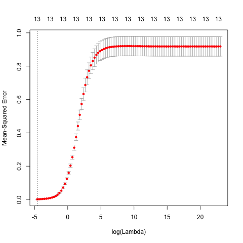
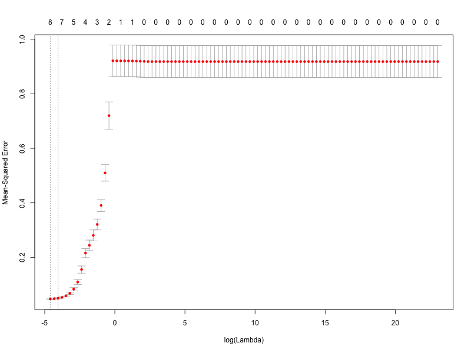
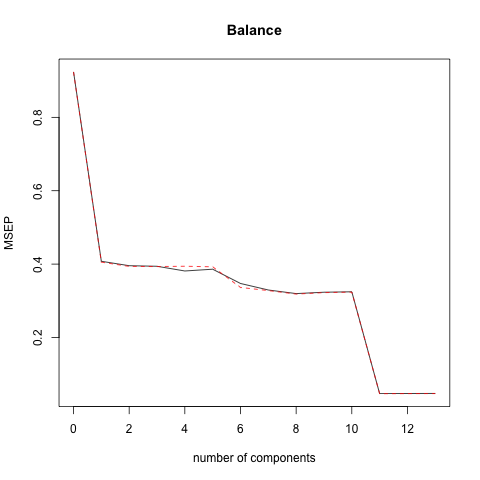
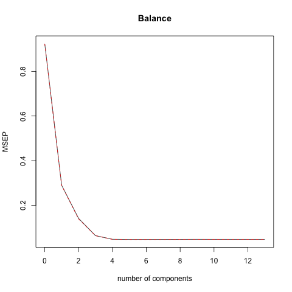

# Abstract

This project is based on the data set and statistical concepts introduced in Chapter 6, **Linear Model Selection and Regularization**, from "An Introduction to Statistical Learning" (by James et al.). The primary objective is to perform mulitple predictive modeling processes applied to the data set *Credit*, as well as learn about the relationship between `Balance` and the rest of the quantitative and qualitative variables. The five models considered are *Ordinary Least Squares*, *Ridge Regression (RR)*, *Lasso Regression (LR)*, *Principal Components Regression (PCR)*, and *Partial Least Squares REgression (PLSR)*. Using cross-validation, the most ideal model is evaluated from their respective Minimum Square Errors on the test sets.


# Introduction

The primary purpose of this report is to determine the best model for predicting `Balance` given the ten different predictors, both quantitative and qualitative from the *Credit* data set. The distributions of these variables will be examined through summaries and plots, and five aforementioned regression models will be applied to the data (*Ridge Regression (RR)*, *Lasso Regression (LR)*, *Principal Components Regression (PCR)*, and *Partial Least Squares REgression (PLSR)*). The means of comparing and analyzing five models will be by studying their respective coefficients and  mean squared errors (MSE) calculated from the 10-fold cross-validation. 

We will discuss our data, methods, analysis, and our main conclusions throughout this paper. These sections will also include diagrams such as tables and graphs to help the reader gain a better understanding of our data and to visualize the outcomes of the different methods.

# Data

We are examining the data set **Credit.csv**, which can be downloaded ([here](http://www-bcf.usc.edu/~gareth/ISL/Credit.csv)), from the book [*An Introduction to Statistical Learning*](http://www-bcf.usc.edu/~gareth/ISL/data.html) by Gareth James, Daniela Witten, Trevor Hastie and Robert Tibshirani.

The data set contains both qualitiative and quantitative variables. The qualitative variables are gender, student, status, and ethnicity. Additonally, the quantitative variables are balance, age, cards, education, income, limit, and rating.

The report is based on **Credit.csv** data set, but all of our analysis is done using **scaled-credit.csv**, which is a standardized version of the original credit data set. To create this new data set we perform mean centering and standardizing(mean zero and sd is one) because we want to have comparable scales to prevent favoritism for certain coefficients. We also scale our data because *glmnet()*, the function we will use for ridge and lasso regressions, does not take factors as data. 

Once we perform analysis on **scaled-credit.csv** using our various regression methods we create various Rdata files with summary statistics for each respective method. These Rdata files are:
	
* OLS_regression.Rdata 

* ridge-regression.Rdata 

* lasso.Rdata

* pc-regression.Rdata 

* plsr_regression.Rdata 


We also create various text files containing summary statistics for each respective method. These text files are:

* ols_regression_output.txt

* ridge-regression-output.txt 

* Lasso_regression.txt 

* pc-regression-output.txt

* plsr_regression.txt

Finally, **train_test.Rdata** contains the training and testing data sets for the regression models. The training data contains 300 elements and the testing data contains 100 elements. The elements of each set are randomized and meant to be reproducible since we set the seed in the script, which produced the 2 sets. The different use of these two sets will be explained in the next section.

# Methods

We built various linear models from the **Credit.csv** data set. We predicted the variable `Balance` in terms of ten predictors: `gender`, `student`, `status`, and `ethnicity`, `age`, `cards`, `education`, `income`, `limit`, and `rating`. 

We created 5 different scripts for running various regression methods: Ordinary Least Squares, Ridge regression, Lasso Regression, Principal Components Regression, and Partial Least Squares Regression.

Our first method, was a simple linear model, Oridnary Least Squares. In **ols_regression.R**, using the lm() where the y variable is Balance and the x variable is the combination of the the rest of the variables, the results from the OLS regression methods are output. This script's outputs will be used as a basis for all other regression models to compare to. We read in the scaled data set, which in turn is used for the regression model.

Our next two methods, Ridge and Lasso regression, are shrinkage methods. The script, **ridge-script.R**, performs a ridge regression and **lasso_regression.R** performs a lasso regression. The steps for these two methods are nearly identical:

1. Load **scaled_credit.csv**, and `library(glmnet)` and set the seed, for reproducibility sake.

2. Create a `x` and `y` varible from the training set, read in from my Rdata file containing training and testing set indicies. 

3. Run `cv.glmnet()` which performs 10-fold cross-validation and outputs an intercept term and standardizes the variables by default. For the function arguements use the `x` and `y` from above, `lambda = 10^seq(10, -2, length = 100)`, `intercept = FALSE`, and `standardize = FALSE` because our **scaled_credit.csv** is already standardized. For ridge regression we use `alpha =0` and for lasso we use `alpha =1`.

4. `cv.glmnet()` will output a list of models. We decide the best one based of the minimum lambda and then save this lambda value as well as the coefficients associated with it.

5. Next we plot the model and save it to a png.

6. Once we identified the best model we use the **test_set** to calculate the test MSE, which will eventually help us compare the performances of all the models.

7. Finally we refit the model to the **scaled_data.csv** which is our entire data set using the lambda from step 4. We save the coefficient estimates and use it in the *Results* section of the report. 

Our next two methods, Principal Components(PCR) and Partial Least Squares regression(PLSR) are dimension reduction methods performed by **pcr-script.R** and **plsr_regression.R** respectively. The steps for these two regression are very similar to those above, so naturall this outline will not go into as much detail.

1. Load **scaled_credit.csv**, and `library(pls)` and set the seed, for reproducibility sake.

2. Create a `x` and `y` varible from the training set, read in from my Rdata file containing training and testing set indicies. 

3. Run `pcr()` or `plsr()` depending on which model you want, and use arguements `Balance ~ .`, `data=train_set`, `validation = CV` and `scale = TRUE`.

4. We decide the best model using `which.min(MODEL$validation$PRESS)` where `MODEL` is the name of the pcr or plsr model depending on the script.

5. Next we plot the model and save it to a png.

6. Once we identified the best model we use the **test_set** to calculate the test MSE, which will eventually help us compare the performances of all the models.

7. Finally we refit the model to the **scaled_data.csv** which is our entire data set using the lambda from step 4. We save the coefficient estimates and use it in the *Results* section of the report. 


```{r,echo=FALSE, message=FALSE}

options(xtable.comment = FALSE)
options(knitr.comment = FALSE)
library(glmnet)
library(pls)
```

# Analysis

In the section,we first generate training and test sets of data, randomization seed establishment, parameter choosing via cross-validation and model fitting for each of the methods in order to study the accuracy of fit for each model

## Exploratory Data Analysis
To look at the basic statistical distributions and summaries of all the variables, the folder `Data` contains all the `.Rdata` and `.txt` files created from the R scripts. Furthermore, relevant plots such as histograms, boxplots, barplots, and conditional boxplots are created that can be accessed in the `Images` folder. Finally, the ANOVA tests were performed using the `aov()` function.

## Pre-modeling Data Processing
Two major processing steps are done before the models are created:

1. Converting the factors into dummy variables:
    
    Transforming the categorizal variables into dummy variables in order to use the built-in function *glmnet* to fit the data.
    
2. Mean centering and standardization
    
    By doing so, we make sure that the coefficients would function properly and in an equivalent manner
    
## Ordinary Least Squares Regression (OLS)
```{r,echo=FALSE,message=FALSE, fig.cap= "MSE value from OLS regression"}
load('../data/OLS.RData')
print(ols_mse)
```
We first fit the Ordinary Least Squares Regression model to the data set, with no parameters to be tuned, using hte `lm()` function. The mean square error of the OLS model on the test set is shown above: 0.04468304. We use this as a reference point when comparing with other prediction models.

## Ridge Regression (RR)
We fit the Ridge Regression model to the training set. Firstly, we need to train the model for the best parameter $\lambda$ via cross-validation (`cv.glmet`). Using `predict()` and calling the library package ` *glment* ` to perform the regression, we get the following:

```{r,echo=FALSE,message=FALSE, fig.cap= "Lambda and MSE value from Ridge regression"}
load('../data/Ridge.RData')
print(lambda_min_ridge)
print(ridge_MSE)
```

From the graph above, we choose the best $\lambda$ given this traning set, which is 0.01 and applied it to the entire data set

The resulting mean square error for the same test set is given above. The 0.05264759 is larger compared to the OLS Regression's 0.04468304.

## Lasso Regression (LR)

We fit the Lasso Regression model to the training set using the same method, but the difference is that the alpha variable in the function `cv.glmnet()` is changed from 0 to 1. 
```{r,echo=FALSE,message=FALSE, fig.cap= "Lambda and MSE value from Lasso regression"}
load('../data/lasso.RData')
print(best_lambda)
print(test_mse)
```

From the graph above, we choose the best $\lambda$ given this traning set, which is also 0.01 and applied it to the entire data set.

The resulting mean square error for the same test set is given above. The 0.05406075 does show a slight deterioration compared to the OLS Regression's 0.04468304.

## Principal Components Regression (PCR)
We  fit the Principal Components Regression to the training set by installing the library package `pls` and using the function `pcr()` to run the cross-validation using the opitimal lambda.

From the validation plot (displayed in the next section), we may find that the lowest cross-validation error occurs when $M = 11$ component are used. Therefore, we compute the test MSE:

```{r,echo=FALSE, message=FALSE, fig.cap= "MSE value from PC regression"}
load('../data/PCR.RData')
print(pcr_MSE)
```

The resulting mean square error for the same test set is given above. The 0.05198999 is slightly higher than the the OLS Regression's 0.04468304, but lower than Lasso. We also fit the model with the best choice of $M$, the number of components to the entire data set for future purpose.

## Partial Least Squares Regression (PLSR)
We  fit the Partial Least Squares Regression to the training set by installing the same library package `pcr` and using the function `plsr()` to run the cross-validation using the opitimal lambda or tuning parameter.

From the validation plot (displayed in the next section), we may find that the lowest cross-validation error occurs when $M = 4$ component are used. Therefore, we compute the test MSE:

```{r,echo=FALSE, message=FALSE, fig.cap= "MSE value from PLS regression"}
load('../data/PLSR.RData')
print(mse)
```

The resulting mean square error for the same test set is given above: 0.05173802 This too is larger than the OLS Regression's 0.04468304. We also fit the model with the best choice of $M$, the number of components to the entire data set for future purpose.

So, apart from the OLS Regression's MSE, the PLSR regression's MSE is the smallest from the 4 other methods. 


# Results

In this section we compare the Lasso Regression with Ridge Regression and the Principal Components Regression with Partial Least Squares Regression.
  
## Lasso and Ridge Regression
    Below are the analogous plots for LR and RR. These plots compare log(lambda) values to MSEP.

```{r,echo=FALSE,fig.align='center', fig.cap= "Plotting MSE against lambda values for ridge and lasso regression respectively"}


``` 

The lambda values in LR and RR determine to what extent the Ridge and Lasso Regression models shrink the effect of regression coefficients. This shrinkage subsequently influences the MSEP errors as seen in the plots. We can note that lasso regression works best with very small lambda values (breaks in the plot) while ridge regression increases in error gradually (continuity). Since Lasso only uses a subset of the coefficient vector while Ridge does not, Lasso involves fewer predictive elements and so a larger tuning (lambda) values would more heavily influence the prediction, and thus the MSE.   
    
## PCR and PLSR

Below are the plots for cross-validation for PCR and PLSR. They compare the number of components used to the cross-validation MSE (MSEP). 
    
```{r,echo=FALSE,fig.align='center', fig.cap= "Validation plots from PC and PLS regression respectively"}


``` 

How the dotted red line fits the solid black line indicates how accurate this regression model is for an arbitrary data set. From the graph, it appears as though PLSR better matches up the expected error with the training set error since the lines are further apart for PCR. However, overall, PLSR minimizes error (MSEP) using fewer components than does PCR, and so there is a potential tradeoff in uncertainty (or error).
    

# Conclusions

The primary goal of this project was to develop regression methods for minimizing MSE on the data sets. Each regression model would optimize the MSE differently. While PCR and PSLR are more heavily rooted in components, LR and RR also distinguish each other through subsetting the predictive elements used for modeling. Overall, from the results, we see that the ordinary least squares regression model attains the lowest mean squared error overall, and the partial least squares regression model yields the lowest MSE of the 4 other regression models. Therefore we conclude that the ordinary least squares model is still the most accurate predictor for Balance from the 10 predictors.