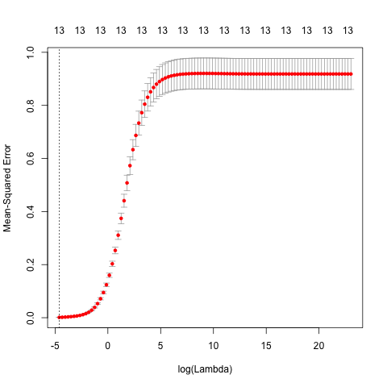
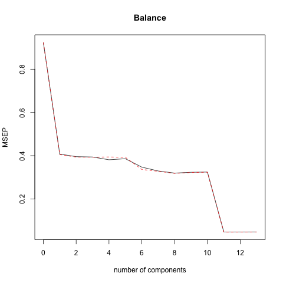
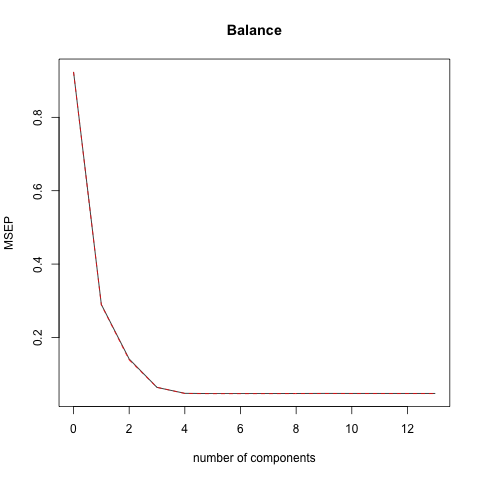

```{r,echo=FALSE, message=FALSE}

options(xtable.comment = FALSE)
options(knitr.comment = FALSE)
library(glmnet)
library(pls)
```

# Objective

## Overview
- Purpose: compare different regression models and observe the optimal one for our data
- Based on the data set and statistical concepts introduced in Chapter 6, **Linear Model Selection and Regularization**, from "An Introduction to Statistical Learning" (by James et al.)

## Original Data
- Data from Credit.csv and consists of many variables
	- qualitative variables: gender, student, status, and ethnicity
	- quantitative variables: balance, age, cards, education, income, limit, and rating

## Scaled Data
- standardized version of the original credit data set 
- we performed mean centering and standardizing(mean zero and sd is one) 
- sclaed data because glmnet(), used for 2 of our regressions, does not take factors as data
- created a train and test set using this set

# Regression Models

## Why did we look at so many models?
- Improve accuracy
- Different models are optimal for different data sets

## OLS
- lm() where the y variable is Balance and the x variable is the combination of the the rest of the variables
-  insert figure for OLS

## Ridge Regression
- shrinkage method
- run cv.glmnet, which performs a 10-fold cross validation
- outputs intercept term and standardizes the variables by default
- We used a range of values for lambda and set intercept = FALSE and standardize = FALSE because of our prescaled data
- Choose the best model based on the minimum lambda and plot this model for visualization purposes
- calculate MSE using testing set
- Perform regression on full data set

## Ridge Regression Image
```{r,echo=FALSE,fig.align='center'}

``` 

## Lasso Regression
- also a shrinkage method
- same exact process as ridge, except in cv.glmnet, set alpha = 1
```{r,echo=FALSE,fig.align='center'}

```  

## PCR
- dimension reduction method
- run pcr() from library pls using arguements Balance ~ ., data=train_set, validation = CV and scale = TRUE
- next we decide the best model by finding the smallest lambda
- We plot the model
- Calculate MSE using the testing set
- Perform regression on full data set

## PCR image
```{r,echo=FALSE,fig.align='center'}

``` 

## PLSR
- another dimension reduction method
- same process as PCR, but we use plsr() isntead of pcr()
```{r,echo=FALSE,fig.align='center'}

``` 

# Results
```{r,echo=FALSE, message=FALSE}

options(xtable.comment = FALSE)
options(knitr.comment = FALSE)
library(glmnet)
library(pls)
library(reshape2)
library(ggplot2)

```

```{r results= 'asis', echo = FALSE}
load('../data/OLS.Rdata')
load('../data/PCR.Rdata')
load('../data/Lasso.Rdata')
load('../data/Ridge.Rdata')
load('../data/PLSR.Rdata')
library(xtable)
Regression <- c('OLS','Ridge', 'Lasso', 'PCR', 'PLSR')
MSE <- c(ols_mse, ridge_MSE, test_mse, pcr_MSE, mse)
mse_chart <- data.frame(Regression, MSE)
mse_tbl <- xtable(mse_chart,
               caption = 'Test MSE Values for the Regression Techniques',
               digits = 7)

print(mse_tbl, caption.placement = 'top',
      comment = getOption('xtable.comment', FALSE),
      include.rownames = FALSE)
```

```{r, results = "asis", echo = FALSE, message = FALSE, warning = FALSE, fig.align = "center"}
load('../data/OLS.Rdata')
load('../data/PCR.Rdata')
load('../data/Lasso.Rdata')
load('../data/Ridge.Rdata')
load('../data/PLSR.Rdata')
library(xtable)

coef_matrix <- matrix(data = c(as.numeric(OLS_summary$coefficients), 
                                  as.numeric(ridge_coef_full),
                                  as.numeric(lasso_coef),0, 
                                  as.numeric(pcr_coef_full), 0, 
                                  as.numeric(coeff)), 
                                  nrow = 12, ncol = 5)

colnames(coef_matrix) <- c('OLS', 'Ridge', 'Lasso', 'PC', 'PLS')
rownames(coef_matrix) <- c('Intercept', 'Income', 'Limit', 'Rating', 'Cards',
                           'Age', 'Education', 'GenderFemale', 'StudentYes',
                           'MarriedYes', 'EthnicityAsian',
                           'EthnicityCaucasian')
print(xtable(coef_matrix, caption = 'Regression Coefficients', digits = 4),
      type = 'latex', comment = FALSE)

```

```{r, echo = FALSE, message = FALSE, warning=FALSE, fig.cap= 'Estimated Regression Coefficients by Variable and Regression'}

# create a data frame for plotting coefficients.
coef_df <- data.frame(type = colnames(coef_matrix), t(abs(coef_matrix)))
# changing the variable names to show what happened after abs value
colnames(coef_df) <- c('type', 'Intercept', 'Abs(Income)', 'Limit', 'Rating',
                       'Cards', 'Abs(Age)', 'Abs(Education)', 
                       'Abs(GenderFemale)', 'StudentYes', 'MarriedYes', 
                       'EthnicityAsian','EthnicityCaucasian')

# use fnc melt to make easier to plot in ggplot. 
coef_tidy <- melt(coef_df, id.vars = 'type')

# change the variable into a factor 
coef_tidy$type <- factor(coef_tidy$type, levels = coef_tidy$type)

# Plotting the different coefficients in barcharts. 
ggplot(coef_tidy, aes(type,value))+
  geom_bar(aes(fill = type), stat = 'identity')+
  facet_wrap(~variable, scales = 'free')+
  ggtitle(label = 'Estimated Regression Coefficients by Variable and Regression')

```


# Conslusions
- Overall, from the table in previous slide, using OLS yields the lowest MSE
- From the 4 additional regression methods implemented, PCR yields the lowest MSE
